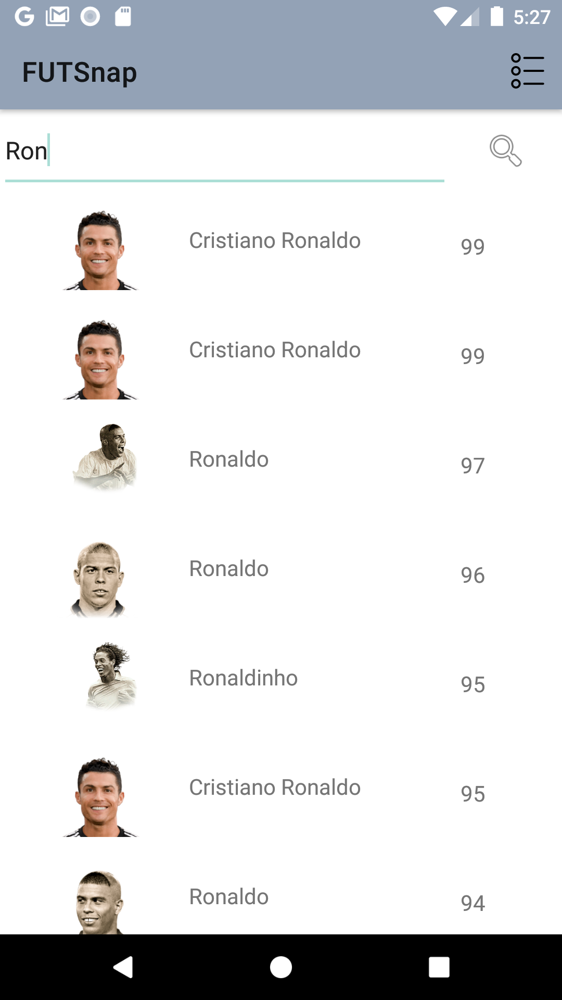
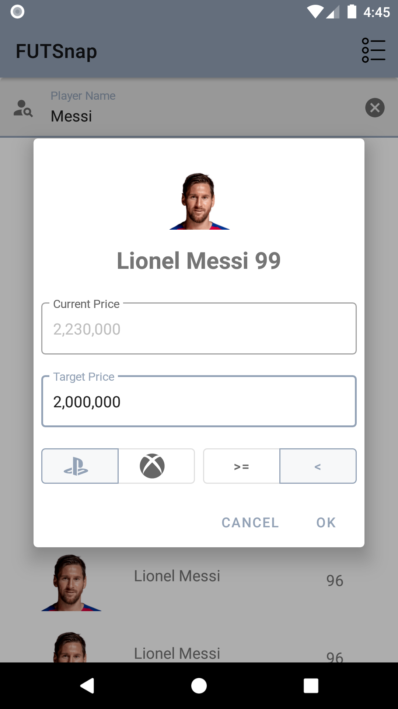
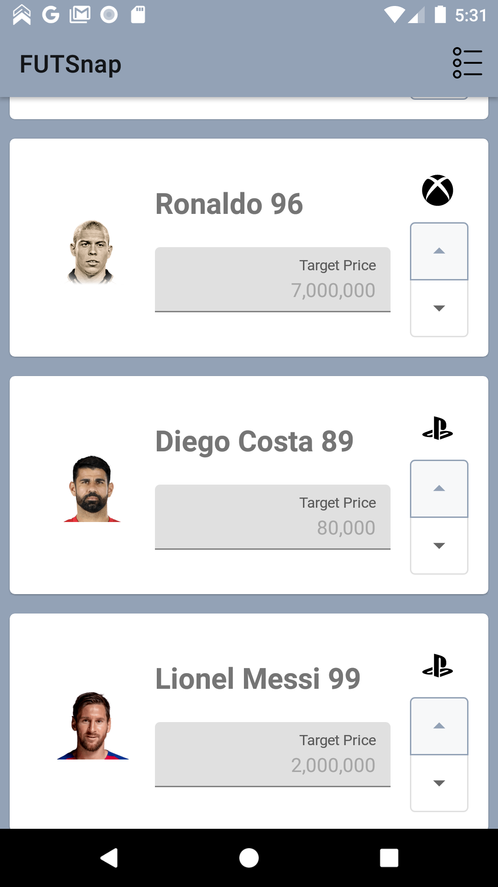
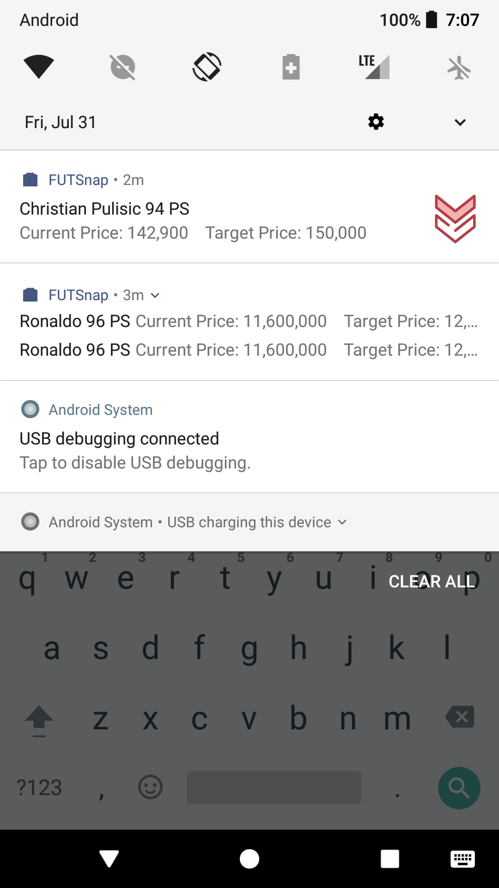
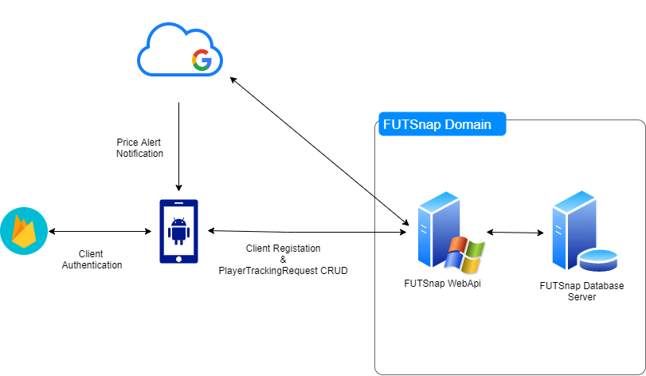

# FUTSnap Android
## Description

FUTSnap is a Price Tracking app for FIFA Ultimate Team (EA Sports VideoGame) players,
where users can be immediately notified of price changes to the players tracked by them!

### Application Design

This application is developed in Kotlin and it implements the MVVM Architecture that is widely
recommended by Google and it uses the following popular libraries:

- **Android Architecture Components** - Maintaining UI component lifecycle and data persistence
- **Dagger2** - Dependency Injection
- **Retrofit + Kotlin Coroutines** - Making API Requests

## Screenshots

<table>
  <tr>
    <td>Player Search Results</td>
     <td>Player Selection Dialog</td>
     <td>Tracked Player List</td>
     <td>Player Price Alert</td>
  </tr>
  <tr>
    <td></td>
    <td></td>
    <td></td>
    <td></td>
  </tr>
 </table>

 ## Architecture Diagram

<kbd>
 
<kbd>
